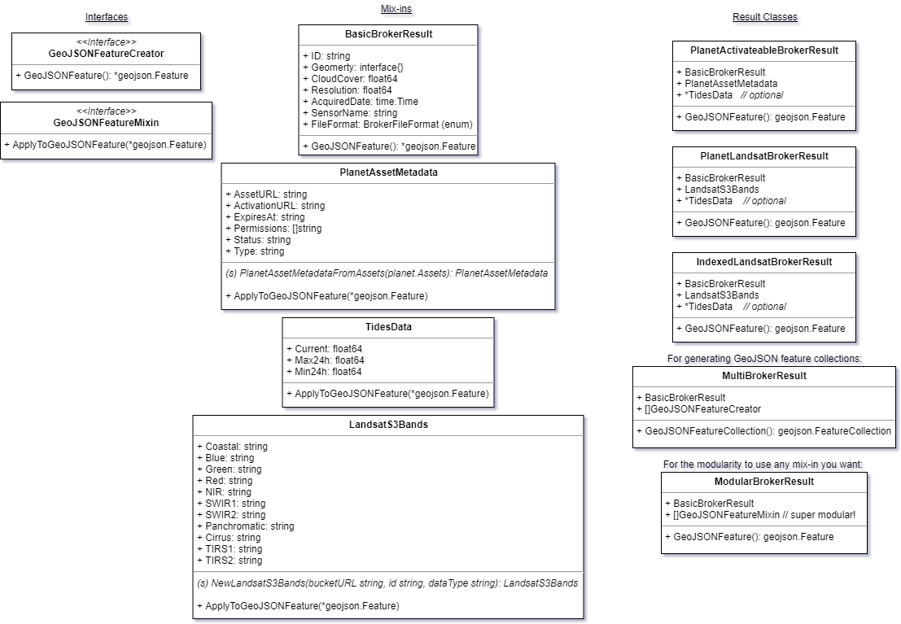

Design for `bf-ia-broker` Self-hosted Image Index
===

This is a draft of design suggestions for the upcoming self-hosted image index
within `bf-ia-broker`.

Contents
---

-   [Postgres Database Connection](#postgres-database-connection)
    -   [Connection handling](#connection-handling)
    -   [Schema management](#schema-management)
    -   [PostGIS support](#postgis-support)
    -   [Database best practices](#database-practices)
-   [Runtime Modes](#runtime-modes)
    -   [`serve` and `ingest_landsat`](#serve-ingest)
    -   [`migrate`](#migrate)
-   [REST API](#rest-api)
    -   [Endpoints](#endpoints)

Postgres Database Connection
---

Go has a standard interface for connecting with any SQL database in the form
of its builtin `database/sql` ([docs](https://godoc.org/database/sql)) package. However, to actually connect to each
individual type of database, a driver is necessary. The most popular and stable
Go driver for PostgreSQL is [`github.com/lib/pq`](https://github.com/lib/pq)
([docs](https://godoc.org/github.com/lib/pq)). Once we inject the Postgres
server connection URL (using PCF VCAP), establishing the actual connection
is trivial.

#### Connection handling

`database/sql` handles connection pooling and recycling itself. We can
instantiate a global `sql.DB` object at the start of runtime, and it will
handle connection pooling/reuse by itself. The DB object has several functions
for configuring the number of simultaneous connections involved, connection
life length, etc.

For each specific "session" (typically, each request), we should open a new
transaction (`sql.Tx`) using `db.Begin()`. This ensures sanity of the
potentially multiple SQL queries to be done, and provides rollback/commit
features.

To check that there is at least one database connection alive (and create one,
if necessary), we can use `db.Ping()`. This can help if done on a timer to make
sure we always have the database available and catch any outages ASAP.

The DB object, and any database-related interactions, should be implemented in
a "common" package, which can then be appropriately used by the various runtime
modes of `bf-ia-broker` (see the [Runtime Modes](#runtime-modes) section). This would ensure the
code is DRY and easily maintainable.

#### Schema management

Same as `bf-api` uses Liquibase to maintain its table schemas, `bf-ia-broker`
must have a solution for keeping track of its schemas and perform migrations.
A popular and well-maintained library to do this using native Go code is
[`github.com/pressly/goose`](https://github.com/pressly/goose)
([docs](http://godoc.org/github.com/pressly/goose)).

The best way for us to use it is to invoke it directly from Go code, not from
the command line. By passing the migration library a database transaction
produced from our common connection code, we can ensure consistency in the way
queries are done (similar to what Java Spring accomplishes with a global
`DataSource`).

The migration process should be invoked as one-off tasks during the Jenkins
pipeline's "Deploy" step. They should be called using `cf run-task` after the
`cf push` and `cf set-env` commands, but before `cf start` is called.  If
`cf start` fails, then `cf run-task` can be called again with a migration
rollback.

More details on the migration runtime mode can be found under [Runtime Modes](#runtime-modes)
below.

#### PostGIS support

By default, the `github.com/lib/pq` driver handles unknown types like so:

> All other types are returned directly from the backend as []byte values in text format.

This is suboptimal, since our tables must depend on types such as the PostGIS
`GEOMETRY` type. Having some sort of way to use these types without needing to
handle the conversions ourselves is important.

There is a library that claims to do what we need: [`github.com/cridenour/go-postgis`](https://github.com/cridenour/go-postgis).
However, it has not seen contributions since 2 years ago, and development seems
to be otherwise incomplete and stalled.

_If we find no suitable solutions, we may need to roll our own._ If we do, the
best way would be to create our own implementation of
[`sql.Scanner`](https://godoc.org/database/sql#Scanner) for each PostGIS
datatype we need.


<a id="database-practices"/>

#### Go database best practices (plus testing!)

To achieve separation of concerns &mdash; and all its associated benefits &mdash;
database queries and models should be implemented in their own, separate
package. That package should then contain a variety of code like this
(if this were hypothetically a blog):

```go
func CreateBlogPost(tx *sql.Tx, bp BlogPost) error {
  _, err := tx.Exec(
    "INSERT INTO blog_posts (title, timestamp, author, text) VALUES ($1, $2, $3, $4)",
    bp.Title, bp.Timestamp, bp.Author, bp.Text,
  )
  return err
}

func GetBlogPostsByAuthor(tx *sql.Tx, author string) ([]BlogPost, error) {
  rows, err := tx.Query(`
    SELECT p.title, p.timestamp, p.author, p.text
      FROM blog_posts p
     WHERE p.author = $1
     ORDER BY p.timestamp DESC
  `, author)
  if err != nil {
    return nil, err
  }

  results := []BlogPost{}
  for rows.Next() {
    bp := BlogPost{}
    err = rows.Scan(&bp.Title, &bp.Timestamp, &bp.Author, &bp.Text)
    if err != nil {
      return nil, err
    }
    results = append(results, bp)
  }
  return results, err
}
```

> **Note:** this is approximate code and might not actually be functional

The code using this can then mock this by storing the function as a variable
that can be replaced at test time:

```go
// title_list.go
var getBlogPostsByAuthor = brokerdb.GetBlogPostsByAuthor

func GetBlogTitleList(tx *sql.Tx, author string) ([]string, error) {
  posts, err := getBlogPostsByAuthor()
  if err != nil {
    return nil, err
  }
  titles := []string{}
  for _, post := range posts {
    titles = append(titles, post.Title)
  }
  return titles, nil
}

// title_list_test.go

func TestGetBlogTitleList_Success(t *testing.T) {
  // Mock
  getBlogPostsByAuthor = func(*sql.Tx, string) ([]BlogPost, error){
    return []BlogPost{
      BlogPost{Title: "Hello World", Timestamp: time.Now(), Author: "filip", Body: "blah blah"},
      BlogPost{Title: "Foo Bar", Timestamp: time.Now(), Author: "filip", Body: "blah blah"},
    }, nil
  }

  // Tested code
  titles, err := GetBlogTitleList(nil, "filip")

  // Asserts
  assert.Nil(t, err)
  assert.Equal(t, []string{"Hello World", "Foo Bar"}, titles)
}

func TestGetBlogTitleList_Error(t *testing.T) {
  // Mock
  getBlogPostsByAuthor = func(*sql.Tx, string) ([]BlogPost, error){
    nil, errors.New("mock database error")
  }

  // Tested code
  _, err := GetBlogTitleList(nil, "filip")

  // Asserts
  assert.NotNil(t, err)
  assert.Contains(t, err.Error(), "mock database error")
}
```

Runtime Modes
---

Beachfront 1.0 and 2.0 implementations of `bf-ia-broker` featured it as a
single executable binary that ran as a HTTP microservice. This was launched by
running `bf-ia-broker serve`, and configured itself using the environment.
It had another (virtually unused) command that just printed its version as well:
`bf-ia-broker version`. These "subcommands" &mdash; serve and version &mdash;
can be considered to be different "runtime modes" that the code runs under; one
launches a web server, while the other just prints some stuff and exits.

We should extend this subcommand structure to support some new runtime modes,
with specific purposes that are wise to segregate from the main web process.
The full list of modes would then be:

| Subcommand       | Arguments | Purpose                                                                                         |                                                                                      |
|------------------|-----------|-------------------------------------------------------------------------------------------------|--------------------------------------------------------------------------------------|
| `version`        |           | print the version and exit                                                                      |                                                                                      |
| `serve`          |           | run the ia-broker web service                                                                   |                                                                                      |
| `ingest_landsat` |           | on an interval, parse the scenes CSV found at `LANDSAT_HOST` and index the images it references |                                                                                      |
| `migrate`        | <code>\[ up     &#124; down MIGRATION_NUMBER ]</code>`                                                                        | apply the proper upgrade/downgrade migration scripts to the database defined in VCAP |

Delegating to the right piece of code would be done with the `urfave/cli`
library, which is already in use to route between `version` and `serve`. Most
notably, this means that all IA Broker code would continue to be packaged as a
_single_ executable, which simplifies the `cf push` process.


<a id="serve-ingest"/>

#### Long-running Processes: `serve` and `ingest_landsat`

These two processes need to start at `cf start` and keep running. Keeping them
as separate processes means we can scale one while keeping the other constant,
or monitor them separately (both in logs and in the PCF UI). Since they use the
same binary image ("droplet" in CF parlance), we can accomplish this by using
multiple CF process types in our `Procfile`. This process is documented
[here](https://www.cloudfoundry.org/blog/build-cf-push-learn-procfiles/). As
such, our new Procfile would look like:

```
web: bf-ia-broker serve
ingest: bf-ia-broker ingest_landsat
```

Assuming Pivotal CloudFoundry implements the CF specs appropriately, this
should start both processes in separate containers, and monitor each one
appropriately &mdash; the web one via HTTP, and the non-web one via Unix
process.

<a id="migrate"/>

#### One-off Process: `migrate`

`migrate` poses a challenge. As a one-off script, it should be run using
`cf run-task` and the appropriate droplet. However, it must:

*   start _after_ the old `serve` and `ingest_landsat` processes shut down,
    so there is no chance of a race condition during migration
*   complete _before_ the main `serve` and `ingest_landsat` processes start,
    so they get their expected database schemas
*   supply output regarding the version to revert to in case of failure, so
    that...
*   in the event of failure of `cf start`, it can run again _before_ the old
    version of the broker processes gets relaunched

This means a thorough overhaul of the logic in our JenkinsFile, which
introduces a short downtime while the migration runs. The new logic of the
"Deploy" step looks something looks like this:

```groovy
current_app = sh 'cf apps | grep "bf-ia-broker"'
new_app = "bf-ia-broker-" + version

sh 'cf push ${new_app} --no-start /*other args*/'
sh 'cf set-env ${new_app} SPACE ${PCF_SPACE}'
sh 'cf set-env ${new_app} DOMAIN ${PCF_DOMAIN}'
// More `cf set-env`

sh 'cf stop ${current_app}'

try {
  db_rollback_version = sh 'cf run-task ${new_app} "bf-ia-broker migrate up"'
} catch { // Problem migrating, start old version of app and fail
  sh 'cf start ${current_app}'
  exit 'migration failed!'
}

try {
  sh 'cf start ${new_app}'
} catch { // Problem starting new app, downgrade DB, restart old version and fail
  try {
    sh 'cf run-task ${new_app} "bf-ia-broker migrate down ${db_rollback_version}"'
    sh 'cf delete ${new_app}'
    sh 'cf start ${current_app}'
    exit 'starting new version failed!'
  } catch { // Rollback failed, everything is terrible :(
    exit 'new version start and rollback failed!'
  }
}
sh 'cf delete ${current_app}''

// Handle route updates to use new_app
```

This change would be neessary both in the regular `JenkinsFile` and in
`JenkinsFile.Promote`. It could be somewhat avoided/simplified if we wanted to
either assume the risk of race conditions at launch time.

> **Note:** `bf-api` currently performs Liquibase migrations at server startup,
> and never rolls back on a failed start, which can lead to a corrupted database
> on a failed deploy. It should receive a similar enhancement.

REST API
---

Like the original Planet-based broker functionality, the new image index will
be accessed via a REST API.

#### Endpoints

The Planet layer of the broker currently provides the following endpoints:

| Endpoint | Output | Purpose |
| -------- | ------ | ------- |
| `/planet/discover/<sourceType>`  | `geojson.FeatureCollection`  | Searching imagery of multiple different sources  |
| `/planet/activate/<sourceType>/<id>`   | `geojson.Feature`  | Triggering availability "activation" of a Rapideye/Planetscope image  |
| `/planet/<sourceType>/<id>`  | `geojson.Feature`  | Metadata retrieval for a single image  |

The new Landsat image index can mirror the same GeoJSON-based search and metadata
system that the Planet endpoints are using. Mirroring the activation step is
unnecessary, as all Landsat images are already "active" in an S3 bucket.

As such, the new endpoints would be:

| Endpoint | Output | Purpose |
| -------- | ------ | ------- |
| `/local_index/discover/<sourceType>` | `geojson.FeatureCollection`  |  Searching imagery in the local index (currently `landsat` only for source type) |
| `/local_index/<sourceType>/<id>` | `geojson.FeatureCollection`  | Metadata retrieval from the local index (currently `landsat` only for source type) |

#### Response data structure (and future-proof consistency/compatibility)

The endpoint return data is more complicated. The results from searching planet
are not mere GeoJSON Features/FeatureCollections; they have several specific
important metadata set in the GeoJSON `properties` that make them actually
useful. This response schema is not currently standardized in any way, and the
way the GeoJSON is built is a little
[opaque and arcane](https://github.com/venicegeo/bf-ia-broker/blob/58a0582/planet/planet.go#L386-L475).

For these reasons, a refactor of the response structure is due, improving
both old Planet code and providing a reasonable common interface for future
other data sources.

A common interface for building common broker responses can be accomplished
by using a simpler intermediate data structure that explicitly describes (using
proper types/functions):

-   the data it encapsulates, using types as accurately as possible
-   associated metadata, defined as narrowly as possible
-   a conversion process to GeoJSON

For example:

```go
type BrokerFileFormat string
const GeoTIFF BrokerFileFormat = "geotiff"
const JPEG2000 BrokerFileFormat = "jpeg2000"

type BasicBrokerResult struct {
  ID string
  Geometry interface{}
  CloudCover float64
  Resolution float64
  AcquiredDate time.Time
  SensorName string
  FileFormat BrokerFileFormat
}

func (br BasicBrokerResult) GeoJSONFeature() *geojson.Feature {
  f := geojson.NewFeature(br.Geometry, br.ID, map[string]interface{
    "cloudCover": br.CloudCover,
    "resolution": br.Resolution,
    "acquiredDate": br.AcquiredDate.String(),
    "sensorName": br.SensorName,
  })
  f.Bbox = f.ForceBbox()
  return f
}
```

More specialized types of results, such as a result containing tide data, can be
encapsulated in their own purpose-made structs that know how to insert their
data in-place into a feature collection. For example, planet asset metadata, and
tides data, could look like this:

```go
type PlanetAssetMetadata struct {
  AssetURL string
  ActivationURL string
  ExpiresAt time.Time
  Permissions []string
  Status string
  Type string
}

func PlanetAssetMetadataFromAssets(assets planet.Assets) PlanetAssetMetadata {
  return PlanetAssetMetadata{
    AssetURL: assets.Analytic.Location,
    ActivationURL: assets.Analytic.Links.Activate,
    ExpiresAt: time.Parse(time.RFC3339, assets.Analytic.ExpiresAt),
    Permissions: assets.Analytic.Permissions,
    Status: assets.Analytic.Status,
    Type: assets.Analytic.Type,
  }
}

func (pam PlanetAssetMetadata) ApplyToGeoJSONFeature(f *geojson.Feature) {
  f.Properties["expires_at"] = pam.ExpiresAt.Format(time.RFC3339)
  f.Properties["location"] = pam.Location
  f.Properties["permissions"] = pam.Permissions
  f.Properties["status"] = pam.Status
  f.Properties["type"] = pam.Type
}

type TidesData struct {
  Current float64
  Max24h float64
  Min24h float64
}

func (td TidesData) ApplyToGeoJSONFeature(f *geojson.Feature) {
  f.Properties["currentTide"] = td.Current
  f.Properties["maximumTide24Hours"] = td.Max24h
  f.Properties["minimumTide24Hours"] = td.Min24h
}
```

This means that these "mixins" can be combined like so:

```go
type PlanetActivateableBrokerResult struct {
  BasicBrokerResult
  PlanetAssetMetadata
  *TidesData
}

func (result PlanetActivateableBrokerResult) GeoJSONFeature() *geojson.Feature {
  f := result.BasicBrokerResult.GeoJSONFeature()
  result.PlanetAssetMetadata.ApplyToGeoJSONFeature(f)
  if (result.TidesData != nil) {
    result.TidesData.ApplyToGeoJSONFeature(f)
  }
  return f
}
```

This `PlanetActivateableBrokerResult` object accomplishes our goals: it
contains the precise pieces of data describing a search result from Planet, in
an easy to comprehend structure, using Go type safety to validate access, and
has an efficient way to convert itself into GeoJSON for output. This is a much
more preferable &mdash; and more modular/extensible way &mdash; to generate
results than our current way.

Some provisional data structures that would be involved in building different
sorts of responses: [broker-classes.png](broker-classes.png)



Their relationships can be illustrated as such: [broker-diagram.png](broker-diagram.png)


> The source document for these illustrations can be found [here](https://drive.google.com/open?id=1K1A6W23VqYsQ2mCdesDIlJNiVkCGtLeU).
